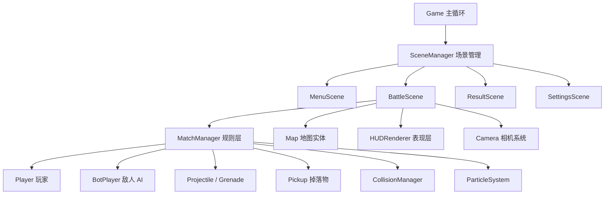

# Circle Siege 需求分析与架构设计文档

## 1. 文档信息

- 项目名称：`Circle Siege`
- 项目类型：基于 `pygame` 的 2D 竞技/生存类枪战游戏
- 文档版本：`v1.0`
- 适用范围：当前本地单机原型，以及后续扩展到完整竞技玩法的架构基线
- 基线日期：`2026-06-23`

## 2. 项目概述

`Circle Siege` 是一个以 `pygame` 为核心技术栈的 2D 竞技枪战项目。当前代码基线已经具备可运行的战斗原型，核心玩法偏向“缩圈生存对抗”，并已实现菜单、战斗、结算、地图主题、AI 敌人、补给投放、手雷、医疗包、HUD 与调试面板等能力。

本项目的目标不是只做一个“能移动和开枪”的示例，而是建设一套结构清晰、便于扩展、充分利用 `pygame` 能力的 2D 枪战框架，使其能够逐步演进为：

- 可持续迭代的单机竞技原型
- 支持多游戏模式的战斗框架
- 具备炫酷视觉表现的 2D 枪战产品雏形

## 3. 建设目标

### 3.1 总体目标

1. 基于 `pygame` 构建稳定的 2D 枪战核心循环。
2. 形成可维护的五层架构：`core / scenes / entities / systems / rules`。
3. 在现有生存模式基础上，预留团队竞技、占点等模式扩展能力。
4. 通过粒子、相机、灯光层、UI 反馈等手段提升“炫酷感”和打击感。
5. 让数值、地图主题、模式规则尽量配置化，减少后期重构成本。

### 3.2 成功标准

- 游戏能够稳定运行在目标帧率附近，输入、渲染、碰撞、战斗逻辑完整闭环。
- 核心战斗过程具备可玩性：移动、瞄准、射击、换弹、拾取、受伤、淘汰、结算。
- 架构层次清晰，新增武器、地图、玩法时无需大面积改动底层代码。
- 场景视觉风格统一，具有明显的竞技氛围和反馈节奏。

## 4. 当前基线状态

根据现有项目结构和代码，当前已经具备以下能力：

### 4.1 已实现能力

- 主菜单、战斗场景、结算场景、设置场景
- 基础场景切换与主循环
- 玩家与 Bot 角色
- 武器、弹道、手雷、医疗包、补给拾取
- 地图主题、出生点、障碍物、补给点
- 安全区缩圈与毒圈伤害
- 补给投放逻辑
- HUD、公告、击杀播报、调试面板
- 相机跟随
- 粒子系统基础效果
- 生存模式结算逻辑

### 4.2 已预留但未完全实现能力

- 团队竞技模式
- 占点模式
- 更完整的复活逻辑
- 更完整的技能系统
- 更真实的音效资源与环境声
- 更复杂的地图互动机制
- 联机同步能力

## 5. 用户与使用场景

### 5.1 目标用户

- 使用 `PyCharm + Python` 学习或开发 2D 游戏的开发者
- 希望基于 `pygame` 做竞技类枪战原型的个人开发者
- 需要一个可继续扩展为课程设计、毕业设计或独立项目的用户

### 5.2 使用场景

- 本地单机试玩
- 原型验证与玩法测试
- 武器平衡和 AI 行为实验
- 地图设计与美术资源接入
- 后续作为联机版或多人版的基础框架

## 6. 需求分析

## 6.1 核心玩法循环

玩家进入地图后，需要围绕以下闭环展开：

1. 出生并获取初始武器。
2. 在安全区内移动、搜集补给、观察敌人。
3. 通过掩体、走位、武器切换和道具使用进行战斗。
4. 随着安全区收缩，被迫转点和交战。
5. 通过击败敌人或存活到最后赢得比赛。
6. 进入结算界面，查看击杀、伤害、生存时间等结果。

## 6.2 功能性需求

### 6.2.1 基础系统需求

- 游戏必须提供统一主循环，负责输入、更新、渲染、帧率控制。
- 游戏必须支持场景切换，包括菜单、战斗、结算、设置。
- 游戏必须支持资源管理，统一加载字体、贴图、音效和配置。

### 6.2.2 角色与战斗需求

- 玩家必须支持移动、瞄准、射击、换弹、切枪、拾取、治疗、投掷手雷。
- Bot 必须支持巡逻、搜敌、追击、规避毒圈、射击和拾取。
- 武器系统必须支持不同枪械参数，包括伤害、射速、弹夹、换弹时间和弹药类型。
- 弹道系统必须支持飞行、碰撞、命中判定和伤害结算。
- 手雷系统必须支持抛投、引信、爆炸范围伤害和伤害提示。

### 6.2.3 地图与交互需求

- 地图必须包含出生点、障碍物、掩体点、补给刷新点。
- 地图必须支持主题化，例如海港工业区、荒漠前哨站、雨林遗迹。
- 地图必须支持安全区收缩。
- 地图需要支持后续加入可交互机关，例如爆炸桶、门、跳板、可破坏遮挡物。

### 6.2.4 规则需求

- 当前版本必须支持生存模式。
- 生存模式必须支持倒计时、缩圈阶段、毒圈伤害、存活判定和结算。
- 架构必须允许后续扩展团队竞技模式、占点模式和击杀目标模式。

### 6.2.5 UI 与反馈需求

- HUD 必须显示血量、弹药、当前武器、手雷、医疗包、倒计时等信息。
- 游戏必须显示公告信息，例如缩圈开始、补给投放、治疗中提示。
- 游戏必须显示击杀播报和结算摘要。
- 游戏必须支持调试信息开关，方便开发和测试。

### 6.2.6 视觉与音频需求

- 游戏必须具备基础粒子特效，例如命中火花、爆炸、伤害数字。
- 相机必须支持跟随，后续建议加入震屏与冲击反馈。
- 音频系统必须支持背景音乐、枪声、爆炸声、拾取声和 UI 反馈音。
- 场景表现必须支持进一步强化，包括霓虹光效、雾层、视差背景和屏幕闪白等。

## 6.3 非功能性需求

### 6.3.1 性能要求

- 默认目标帧率为 `60 FPS`。
- 常规对局中，角色、子弹、粒子数量增加时仍需保持流畅。
- 优先使用 `pygame.Rect` 做常规碰撞；仅在必要场景下使用精确碰撞。

### 6.3.2 可维护性要求

- 各层职责必须清晰，避免把规则、渲染、输入和地图逻辑混在一个类中。
- 地图主题、武器数值、模式配置必须集中管理。
- 新增武器、地图、拾取物时应尽量通过配置或局部扩展完成。

### 6.3.3 可扩展性要求

- 需要保留多人模式或联网同步的演进空间。
- 需要保留技能系统、更多模式、更多特效、更多地图主题的接入空间。
- 各系统之间应通过明确接口协作，而不是大量跨层直接耦合。

### 6.3.4 可测试性要求

- 关键逻辑应尽量具备可单独验证的接口，例如伤害结算、缩圈推进、拾取判断。
- 调试面板应继续保留并扩展，便于观察玩家状态、AI 状态与安全区状态。

## 7. 技术选型与 pygame 利用策略

本项目坚持 `pygame-first` 原则，即优先使用 `pygame` 已经提供的成熟能力，而不是重复造轮子。

### 7.1 直接利用的 pygame 能力

- `pygame.Surface`：地图层、角色贴图、UI 层、光效层、雾层
- `pygame.Rect`：位置、碰撞、摄像机视口与拾取判定
- `pygame.math.Vector2` 或项目封装向量：移动、加速度、弹道方向、插值
- `pygame.event`：输入事件、调试开关、模式通知事件
- `pygame.time.Clock`：帧率控制与 `dt`
- `pygame.draw`：准星、血条、调试几何、区域轮廓
- `pygame.transform`：旋转、翻转、缩放
- `pygame.mixer`：背景音乐和战斗音效
- `pygame.font`：HUD、公告、结算文字

### 7.2 设计原则

- 能用 `Rect` 的碰撞场景，不优先使用像素级碰撞。
- 能通过分层 `Surface` 实现的视觉效果，不优先引入复杂外部依赖。
- 地图、角色、道具更新逻辑保持数据驱动，渲染逻辑集中到场景和表现层。

## 8. 总体架构设计

项目采用分层模块化架构，以 `Game` 为入口，以 `Scene` 为运行容器，以 `MatchManager` 为规则枢纽。

## 9. 模块分层设计

### 9.1 `core` 核心层

职责：

- 初始化 `pygame`
- 创建窗口、时钟、字体与全局资源
- 管理场景切换
- 提供统一配置与资源接口

核心对象：

- `Game`
- `SceneManager`
- `BaseScene`
- `ResourceManager`
- `config`

### 9.2 `scenes` 场景层

职责：

- 隔离不同界面与流程状态
- 将输入、逻辑更新、渲染组织成稳定生命周期

核心对象：

- `MenuScene`
- `BattleScene`
- `ResultScene`
- `SettingsScene`

### 9.3 `entities` 实体层

职责：

- 封装场景中的可交互对象
- 管理对象自身状态和基础行为

核心对象：

- `Player`
- `BotPlayer`
- `Character`
- `Weapon`
- `Projectile`
- `Grenade`
- `Pickup`
- `Map`

### 9.4 `systems` 系统层

职责：

- 负责跨实体协作的基础机制
- 保持系统可复用与相对独立

核心对象：

- `Camera`
- `CollisionManager`
- `ParticleSystem`
- `AudioManager`
- `AI`

### 9.5 `rules` 规则层

职责：

- 管理比赛模式、进程、胜负和动态事件
- 持有安全区、时间推进、角色集合、补给与公告

核心对象：

- `MatchManager`
- `SafeZone`
- `Banner`

### 9.6 `presentation` 表现层

职责：

- 绘制 HUD、提示信息和调试界面
- 将底层数据转化成易读的屏幕信息

核心对象：

- `HUDRenderer`

## 10. 核心类职责说明

### 10.1 `Game`

- 驱动整体主循环
- 收集输入事件
- 控制 `dt` 和帧率
- 调用当前场景的 `handle_events / update / draw`

### 10.2 `BattleScene`

- 持有本局战斗上下文
- 协调 `MatchManager`、`Camera`、`HUDRenderer`
- 管理战斗内快捷键，如换弹、切枪、拾取、调试开关

### 10.3 `MatchManager`

- 管理本局配置、角色集合、掉落物、投掷物、计时与公告
- 调度玩家更新、Bot 更新、碰撞结算、毒圈推进、补给投放和胜负判定
- 作为战斗场景的逻辑中枢

### 10.4 `SafeZone`

- 负责缩圈阶段、半径变化、圈心变化和圈外伤害参数
- 为战局提供节奏压力和转点驱动力

### 10.5 `Player / BotPlayer`

- `Player` 负责本地输入映射和主动行为
- `BotPlayer` 负责 AI 行为选择与目标处理
- 二者共享角色基础能力，但输入来源不同

### 10.6 `CollisionManager`

- 处理子弹飞行和命中
- 处理手雷与爆炸范围伤害
- 统一输出命中事件和爆炸事件供规则层与表现层消费

### 10.7 `HUDRenderer`

- 负责战斗信息展示
- 包括准星、血条、弹药、公告、击杀播报、调试信息

## 11. 数据与配置设计

建议继续采用配置集中化策略，将以下数据保持为可配置或可集中维护状态：

- `GameConfig`：分辨率、帧率、字体、音量、输入偏好
- `MatchConfig`：模式名、玩家数量、击杀目标、时限、复活规则
- `ThemeConfig`：地图主题色、地表风格、障碍风格、UI 强调色
- `WeaponSpec`：武器类型、射速、伤害、弹夹、扩散、弹药类型
- `ZonePhase`：安全区阶段参数，包括停留时间、收缩时间、半径比例、伤害

配置集中化的收益：

- 调整数值时不需要深入改动业务逻辑
- 更适合后续加新主题、新模式和新枪械
- 更方便做平衡性测试

## 12. 地图与场景设计要求

### 12.1 地图设计原则

- 必须有主战斗区和转点路线
- 必须避免出生点直接被架死
- 必须同时提供近战、中距离、绕后路线
- 必须保证缩圈后仍有一定掩体分布

### 12.2 炫酷场景目标

建议优先做一个主打风格地图：`赛博工业雨夜竞技场`

视觉元素建议：

- 霓虹标牌
- 雨夜地面反光
- 工业灯带
- 蒸汽和烟雾层
- 能量核心或大型机械装置作为视觉焦点
- 远景建筑视差滚动

### 12.3 演出层建议

- 开枪时出现枪口闪光
- 爆炸时出现屏幕轻微震动和短暂高亮
- 低血量时屏幕边缘出现受伤提示
- 缩圈阶段通过颜色、边框和提示文本形成明确压迫感

## 13. 开发阶段划分

### 阶段一：稳定原型

- 主循环稳定
- 玩家控制稳定
- 子弹、碰撞、伤害闭环完整
- 一张地图可完整打完一局

### 阶段二：可玩版本

- 多武器可切换
- Bot 对抗完整
- 缩圈节奏合理
- HUD 和结算完整

### 阶段三：竞技化增强

- 武器平衡调优
- 更多补给和掩体策略
- 更清晰的击杀播报与战局反馈
- 更完善的设置选项

### 阶段四：炫酷化增强

- 强化粒子和光效
- 引入更明显的主题风格
- 增加环境装饰和动态场景元素
- 补足战斗打击感和屏幕反馈

### 阶段五：模式扩展

- 团队竞技
- 占点模式
- 更复杂 AI
- 技能系统
- 为联机预留同步边界

## 14. 风险与约束

### 14.1 技术风险

- 如果将过多逻辑堆进 `BattleScene` 或 `MatchManager`，后续维护成本会迅速升高。
- 如果所有碰撞都做高精度判定，性能会明显下降。
- 如果过早引入联机功能，可能导致当前本地逻辑还未稳定就发生架构漂移。

### 14.2 资源风险

- 高质量枪声、爆炸、环境音和美术资源不足时，成品观感会明显受限。
- 炫酷场景依赖分层美术、粒子和色彩设计，若只靠基础图形绘制，视觉上限有限。

### 14.3 架构约束

- 当前项目以单机逻辑为主，后续如果要联机，需要重新审视状态同步、权威逻辑和输入延迟补偿设计。
- 当前规则层以生存模式为中心，新增团队模式时需要进一步抽象模式接口。

## 15. 后续建议

1. 先把 `MatchManager` 按“模式无关逻辑”和“生存模式逻辑”拆开，降低耦合。
2. 给地图和武器增加更清晰的数据配置结构，减少硬编码。
3. 将相机震动、受击闪烁、局部光效纳入独立表现系统。
4. 在文档基础上继续输出一份“详细类设计文档”或“开发任务拆解清单”。

## 16. 结论

`Circle Siege` 当前已经具备不错的 `pygame` 枪战原型基础，现阶段最重要的不是继续堆功能，而是把需求边界、规则职责、系统分层和扩展方向固定下来。

本文件的作用是为后续开发提供统一基线：

- 明确当前已经做到了什么
- 明确下一步应该补什么
- 明确每一层代码该负责什么
- 明确如何充分利用 `pygame`，而不是脱离它重新造一套底层系统

在此基线上继续推进，项目可以从“可运行原型”逐步演进为“结构完整、表现成熟、玩法清晰”的 2D 竞技枪战游戏。
